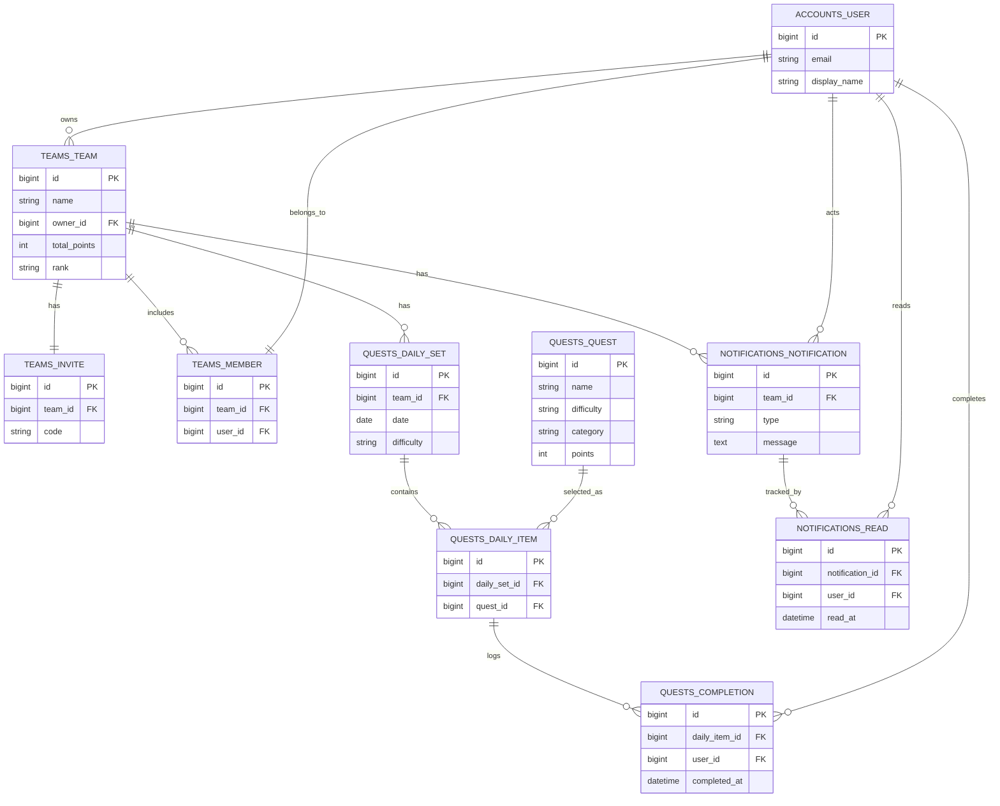

# Team-17-Django

Tech jam2026冬 反保 福田 麻衣 新 村瀬

# 担当箇所（小林麻衣）
フロントエンド：HTML＆CSS(チーム画面,ダッシュボード)
バックエンド：teamsの機能のviews.pyの実装
その他: GitHubでのプルリクエスト作成

## Environment

- Python: 3.12.x
- Django: 5.x
- pip: 24.x

※ 開発は macOS / Python 3.12 環境で行っています

## Setup (Local)

```bash
python3 -m venv venv
source venv/bin/activate
pip install -r requirements.txt
cd src
python manage.py runserver
```
---

# G-BASE（ジーベース）

## アプリ名
**G-BASE（ジーベース）**

**命名理由**  
- Group の **G**
- Gym の **G**  
- 5人だけの「秘密基地（BASE）」で、こっそり強くなるというコンセプト  
- BASE感を意識した **五角形ロゴ**を想定

---

## 目的

| 項目 | 内容 |
|---|---|
| 主目的 | チームでクエスト（ストレッチ・筋トレ）に取り組める環境を提供 |
| 可視化 | ポイント・レベルによって成果を可視化 |
| 継続性 | 運動を「習慣化」することを支援 |

---

## 提供する価値

| 観点 | 内容 |
|---|---|
| コミュニティ | 狭いコミュニティで、友達と一緒に行動できる |
| 心理的ハードル | 一人では続かない運動を、仲間となら続けられる |
| 成長実感 | クエスト難易度 × ポイントで成長を数値化 |
| モチベーション | ポイント蓄積によるランクアップ |

---

## サービス概要

| 項目 | 内容 |
|---|---|
| コミュニティ形式 | 招待制・クローズド |
| チーム人数 | **2〜5人限定** |
| 制約理由 | 人数が多いと「誰かがやる」心理が働くため |
| コンセプト | 不特定多数ではなく、知っている人と成長 |
| クエスト | 難易度別（初級 / 中級 / 上級） |
| 提案形式 | 毎日ランダムに約4つのクエストを提示 |
| レベル | チームポイントに応じて難易度・挑戦内容が変化 |

---

## ユーザーストーリー

| 項目 | 内容 |
|---|---|
| ユーザー | 運動を習慣化したい人 |
| 課題 | 一人だと続かない |
| 解決 | チームでクエストに取り組む |
| 成果 | ポイントとレベルで成長を実感 |

---

## ユースケース一覧（MVP）

### ① ログイン・登録

| 項目 | 内容 |
|---|---|
| アクター | ユーザー |
| 目的 | サービスを利用する |
| 基本フロー | 1. メール＋パスワード入力<br>2. ログイン成功<br>3. チーム選択画面へ遷移 |

---

### ② チーム作成

| 項目 | 内容 |
|---|---|
| アクター | ユーザー |
| 目的 | 新しいチームを作成 |
| 基本フロー | 1. チーム名入力<br>2. チーム作成<br>3. 招待コード発行<br>4. 自動的にチーム所属 |

---

### ③ チーム参加（招待）

| 項目 | 内容 |
|---|---|
| アクター | ユーザー |
| 目的 | 友達のチームに参加 |
| 基本フロー | 1. 招待コード入力<br>2. チーム存在チェック<br>3. チーム所属<br>4. ダッシュボード遷移 |

---

### ④ クエスト確認

| 項目 | 内容 |
|---|---|
| アクター | ユーザー |
| 目的 | 今日やる運動を知る |
| 基本フロー | 1. ダッシュボード表示<br>2. チームポイントから難易度決定<br>3. 今日のクエスト表示 |

---

### ⑤ クエスト達成

| 項目 | 内容 |
|---|---|
| アクター | ユーザー |
| 目的 | 運動を実施・記録 |
| 基本フロー | 1. 今日のクエスト確認<br>2. 達成ボタン押下<br>3. 達成ログ保存<br>4. チームポイント加算<br>5. レベル更新判定 |

---

### ⑥ チーム進捗確認

| 項目 | 内容 |
|---|---|
| アクター | ユーザー |
| 目的 | メンバーの進捗確認 |
| 基本フロー | 1. チーム画面表示<br>2. メンバーごとの達成状況確認 |

---

### ⑦ 達成通知確認

| 項目 | 内容 |
|---|---|
| アクター | ユーザー |
| 目的 | 仲間の行動を知る |
| 基本フロー | 1. チーム画面表示<br>2. 「○○さんが達成しました」を確認 |

---

### ⑧ レベル確認

| 項目 | 内容 |
|---|---|
| アクター | ユーザー |
| 目的 | 成果の可視化 |
| 基本フロー | 1. ダッシュボード表示<br>2. チームLv確認 |

---

## ランク・ポイント設計

| ランク | 到達ポイント |
|---|---|
| F → E | 100 pt |
| E → D | 300 pt |
| D → C | 600 pt |
| C → B | 1100 pt |
| B → A | 1600pt |

---

## クエスト難易度別設計

### 初級（10pt）｜習慣化
| 種目 | 回数 / 時間 |
|---|---|
| かかと上げ下げ | 20回 |
| 椅子スクワット | 10回 |
| 壁腕立て伏せ | 10回 |
| 膝抱えストレッチ | 左右20秒 |
| キャット＆カウ | 5往復 |
| ドローイン | 30秒 |
| 首ストレッチ | 左右20秒 |
| 肩甲骨回し | 前後10回 |
| 足パカ | 15回 |
| ラジオ体操 | 約3分 |

---

### 中級（40pt）｜体の変化
| 種目 | 回数 / 時間 |
|---|---|
| スクワット | 15回×2 |
| プランク | 30〜45秒 |
| リバースランジ | 20回 |
| 膝つき腕立て | 12回 |
| マウンテンクライマー | 30秒 |
| ヒップリフト | 20回 |
| トカゲのポーズ | 左右30秒 |
| レッグレイズ | 10〜15回 |
| バックエクステンション | 15回 |
| サイドプランク | 左右30秒 |

---

### 上級（100pt）｜限界挑戦
| 種目 | 回数 / 時間 |
|---|---|
| バーピー | 15〜20回 |
| ブルガリアンスクワット | 左右12回 |
| 腕立て伏せ | 15〜20回 |
| ワイドスクワット | 100秒 |
| バイシクルクランチ | 30回 |
| V字腹筋 | 10〜15回 |
| ジャンピングランジ | 20回 |
| ホローロック | 30〜45秒 |
| プッシュアップtoサイド | 12回 |
| タックジャンプ | 10〜15回 |

---
## ER図（概要）


---
## テーブル設計

> 表記ルール  
> - **PK**: Primary Key  
> - **FK**: Foreign Key  
> - **INDEX**: Index  
> - **UNIQUE**: Unique Constraint  

---

### accounts_user（ユーザー）

| カラム | 型 | 制約 | 説明 |
|---|---|---|---|
| id | bigint | **PK** | Django標準ID |
| email | EmailField | **UNIQUE**, **INDEX** | ログインID（小文字正規化前提） |
| display_name | varchar(30) | **NOT NULL** | 表示名（UIで必須想定） |
| password | varchar |  | AbstractBaseUser標準 |
| is_active | boolean | default=true | 有効フラグ |
| is_staff | boolean | default=false | 管理画面アクセス用 |
| is_superuser | boolean |  | PermissionsMixin標準 |
| last_login | datetime |  | AbstractBaseUser標準 |
| created_at | datetime | auto_now_add | 作成日時 |
| updated_at | datetime | auto_now | 更新日時 |

**インデックス**
- `idx_accounts_user_email (email)`

---

### teams_team（チーム）

| カラム | 型 | 制約 | 説明 |
|---|---|---|---|
| id | bigint | **PK** | チームID |
| name | varchar(30) | **NOT NULL** | チーム名 |
| owner_id | bigint | **FK(accounts_user.id)**, on_delete=PROTECT | 作成者（オーナー） |
| max_members | smallint | default=5 | 最大人数（MVP: 2〜5） |
| member_count | smallint | default=1 | 所属人数キャッシュ（owner含む想定） |
| total_points | int | default=0 | チーム累計ポイントキャッシュ |
| rank | char(1) | default="F" | ランク（S〜F） |
| created_at | datetime | default=now | 作成日時 |
| updated_at | datetime | auto_now | 更新日時 |
| is_active | boolean | default=true | 有効フラグ |
| dissolved_at | datetime | null | 解散日時（任意） |

**ビジネスルール（モデル clean）**
- `max_members` は **2〜5**
- `member_count <= max_members`
- クエスト解放条件: `member_count >= 2`

**インデックス**
- `idx_teams_team_rank (rank)`
- `idx_teams_team_total_points (total_points)`

---

### teams_invite（招待コード）

| カラム | 型 | 制約 | 説明 |
|---|---|---|---|
| id | bigint | **PK** | 招待ID |
| team_id | bigint | **FK(teams_team.id)**, **UNIQUE**, on_delete=CASCADE | 1チーム1招待コード |
| code | varchar(16) | **UNIQUE**, **INDEX** | 招待コード |
| is_active | boolean | default=true | 有効/無効 |
| expires_at | datetime | null | 失効日時（MVPでは未使用でもOK） |
| created_at | datetime | default=now | 作成日時 |
| updated_at | datetime | auto_now | 更新日時 |

**インデックス**
- `idx_teams_invite_code (code)`

---

### teams_member（チーム所属）

| カラム | 型 | 制約 | 説明 |
|---|---|---|---|
| id | bigint | **PK** | 所属ID |
| team_id | bigint | **FK(teams_team.id)**, on_delete=CASCADE | 所属チーム |
| user_id | bigint | **FK(accounts_user.id)**, **UNIQUE**, on_delete=CASCADE | **1ユーザー=1チーム**を強制 |
| joined_at | datetime | default=now | 参加日時 |

**インデックス**
- `idx_teams_member_team_joined (team_id, joined_at)`

---

### quests_quest（固定クエスト）

| カラム | 型 | 制約 | 説明 |
|---|---|---|---|
| id | bigint | **PK** | クエストID |
| name | varchar(100) | **NOT NULL** | 種目名 |
| difficulty | varchar(10) | choices | easy / normal / hard |
| category | varchar(10) | choices | stretch / muscle |
| description | text | blank | 回数/秒など説明 |
| points | int | **NOT NULL** | difficultyと一致必須（cleanでガード） |
| is_active | boolean | default=true | 有効フラグ |
| created_at | datetime | default=now | 作成日時 |
| updated_at | datetime | auto_now | 更新日時 |

**ビジネスルール（モデル clean）**
- `easy=10`, `normal=40`, `hard=100` に `points` を固定一致

**インデックス**
- `idx_quests_quest_diff_cat_active (difficulty, category, is_active)`

---

### quests_daily_set（チーム×日付の「今日の提示」）

| カラム | 型 | 制約 | 説明 |
|---|---|---|---|
| id | bigint | **PK** | セットID |
| team_id | bigint | **FK(teams_team.id)**, on_delete=CASCADE | 対象チーム |
| date | date | **UNIQUE(team_id, date)** | JST想定の日付 |
| difficulty | varchar(10) | choices | 今日の難易度 |
| generated_by | varchar(10) | default="logic" | logic / ai 等 |
| created_at | datetime | default=now | 作成日時 |
| updated_at | datetime | auto_now | 更新日時 |

**制約**
- `uq_daily_set_team_date (team_id, date)`

**インデックス**
- `idx_quests_daily_set_team_date (team_id, date)`
- `idx_quests_daily_set_date (date)`

---

### quests_daily_item（DailyQuestSet に紐づく「4つ」）

| カラム | 型 | 制約 | 説明 |
|---|---|---|---|
| id | bigint | **PK** | アイテムID |
| daily_set_id | bigint | **FK(quests_daily_set.id)**, on_delete=CASCADE | 親セット |
| quest_id | bigint | **FK(quests_quest.id)**, on_delete=PROTECT | 固定クエスト（削除事故防止） |
| sort_order | smallint | default=0 | 並び順 |
| created_at | datetime | default=now | 作成日時 |

**制約**
- `uq_daily_item_set_sort (daily_set_id, sort_order)`（同じ順序の重複禁止）
- `uq_daily_item_set_quest (daily_set_id, quest_id)`（同じクエスト重複禁止）

**インデックス**
- `idx_quests_daily_item_set_sort (daily_set_id, sort_order)`

---

### quests_completion（達成ログ）

| カラム | 型 | 制約 | 説明 |
|---|---|---|---|
| id | bigint | **PK** | 達成ID |
| daily_item_id | bigint | **FK(quests_daily_item.id)**, on_delete=CASCADE | 対象クエスト枠 |
| user_id | bigint | **FK(accounts_user.id)**, on_delete=CASCADE | 達成ユーザー |
| completed_at | datetime | default=now | 達成日時 |

**制約**
- `uq_completion_dailyitem_user (daily_item_id, user_id)`（二重達成防止）

**インデックス**
- `idx_quests_completion_user_completed (user_id, completed_at)`

---

### notifications_notification（チーム通知）

| カラム | 型 | 制約 | 説明 |
|---|---|---|---|
| id | bigint | **PK** | 通知ID |
| team_id | bigint | **FK(teams_team.id)**, on_delete=CASCADE | 対象チーム |
| type | varchar(30) | choices, **INDEX** | member_completed / daily_ready / team_rank_up / system |
| message | text | **NOT NULL** | 通知本文（AI文言も想定） |
| actor_id | bigint | **FK(accounts_user.id)**, on_delete=SET_NULL, null | 起因ユーザー（任意） |
| created_at | datetime | default=now | 作成日時 |

**インデックス**
- `idx_notifications_team_created (team_id, created_at)`（タイムライン取得用）
- `idx_notifications_type (type)`

---

### notifications_read（既読管理）

| カラム | 型 | 制約 | 説明 |
|---|---|---|---|
| id | bigint | **PK** | 既読ID |
| notification_id | bigint | **FK(notifications_notification.id)**, on_delete=CASCADE | 対象通知 |
| user_id | bigint | **FK(accounts_user.id)**, on_delete=CASCADE | 既読ユーザー |
| read_at | datetime | default=now | 既読日時 |

**制約**
- `uq_notification_read (notification_id, user_id)`（既読の重複防止）

**インデックス**
- `idx_notifications_read_user_readat (user_id, read_at)`

---

## ディレクトリ構成

```text
src/
├── manage.py
├── config/
│   ├── settings/
│   │   ├── base.py
│   │   ├── local.py
│   │   └── prod.py
│   ├── urls.py
│   ├── asgi.py
│   └── wsgi.py
├── apps/
│   ├── accounts/
│   ├── dashboard/
│   ├── integrations/openai/
│   ├── notifications/
│   ├── quests/
│   │   └── management/commands/seed_quests.py
│   └── teams/
├── templates/
├── static/
└── docs/


